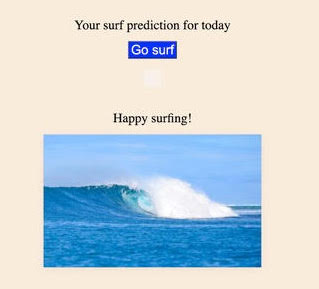

# Mixed Messages

Mixed Messages is a message generator program. Every time a user runs a program, they should get a new, randomized output.

## Languages
+ JavaScript
+ HTML5
+ CSS3

## Technologies
+ Visual Studio Code
+ Git

## Launch

[Link] { https://julianena.github.io/Message-Generator/ }
To run this program click the "Go surf " button and a random surf message will show.

## Screenshot

